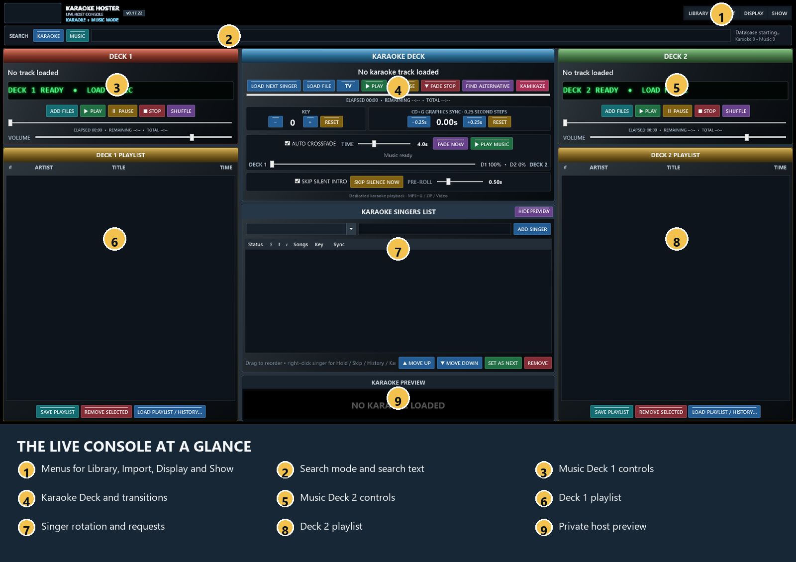
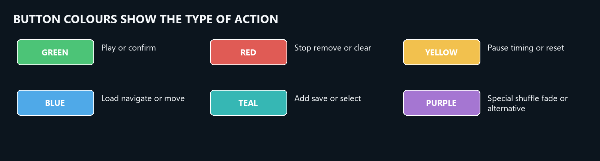
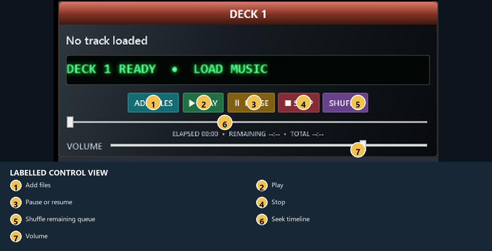
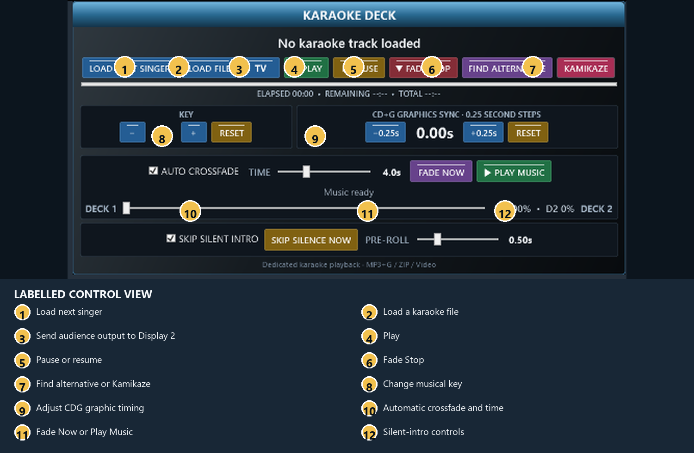
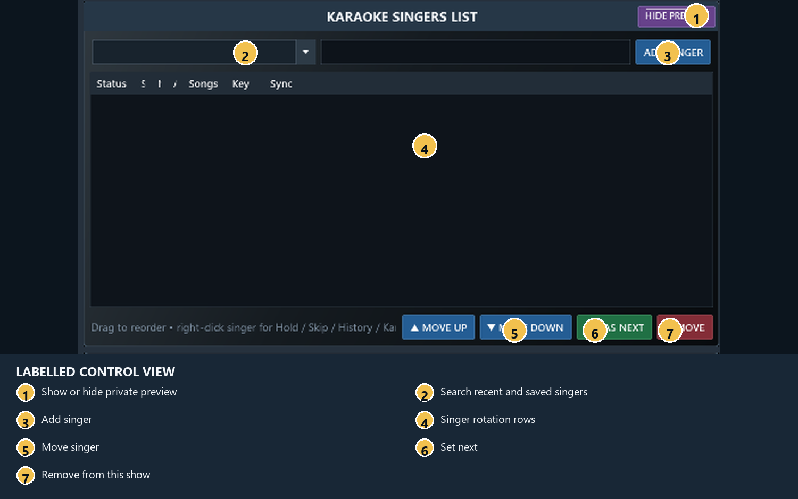
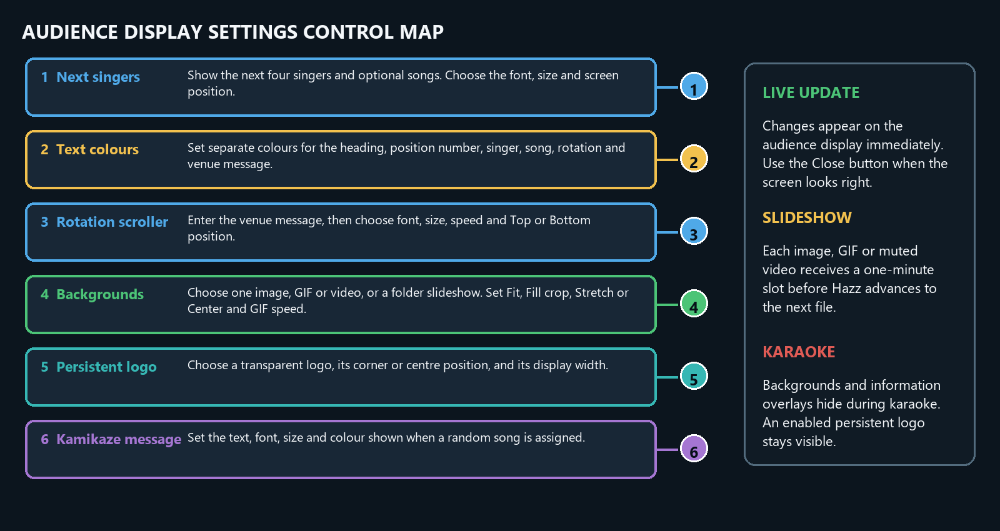
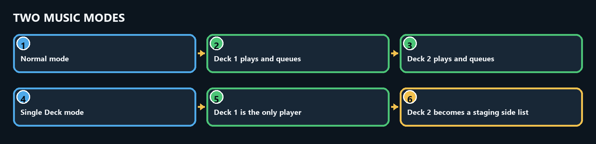
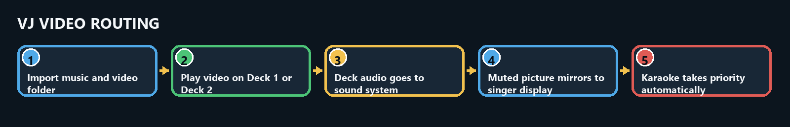
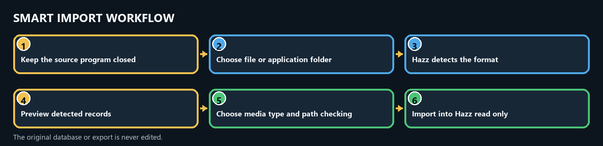
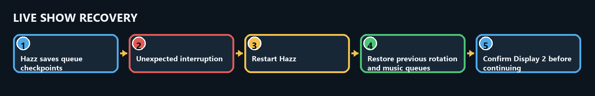

# Hazz Karaoke Hoster Complete Illustrated User Manual

Every screen, button, workflow and live-show function for version 0.80.

## Visual guides

## Main control reference

The Word and PDF editions contain the expanded control-by-control reference, workflows, troubleshooting guide, supporting-window descriptions and Visual Studio build instructions.

### Live sequence

1. Import and test the karaoke and music libraries.
2. Open the audience display and send it to Display 2.
3. Add a singer and drag a request onto their row.
4. Press Load Next Singer and check the preview.
5. Press Play.
6. Press Fade Stop at the end so karaoke fades out and music fades in.

### Safety

Keep the host console on Display 1, keep media drives connected while Hazz is open, and shut down through the main window confirmation.

## Detailed written reference
Every screen, button, workflow and live-show function for version 0.80.

## Visual guides

## Main control reference

The Word and PDF editions contain the expanded control-by-control reference, workflows, troubleshooting guide, supporting-window descriptions and Visual Studio build instructions.

### Live sequence

1. Import and test the karaoke and music libraries.
2. Open the audience display and send it to Display 2.
3. Add a singer and drag a request onto their row.
4. Press Load Next Singer and check the preview.
5. Press Play.
6. Press Fade Stop at the end so karaoke fades out and music fades in.

### Safety

Keep the host console on Display 1, keep media drives connected while Hazz is open, and shut down through the main window confirmation.

## Detailed written reference
Complete operating documentation for version 0.80.

## 1 Getting started

### What Hazz Karaoke Hoster does

Hazz Karaoke Hoster is a Windows live-show console for running a singer rotation, playing CD+G and video karaoke, and managing two background-music decks. It keeps the host controls on the main display and can place the singer output full screen on a second display.

### Before your first show

- Use a Windows 64-bit computer and connect the audience television or projector before opening Hazz.
- Keep karaoke and music files on drives that will remain connected during the show.
- Test Windows sound output, the second display, and several representative song formats before guests arrive.
- Keep a current database backup and avoid moving indexed files immediately before a show.

### Run the supplied build

Open RELEASE\HazzKaraokeHoster and double-click Hazz Karaoke Hoster.exe. The release is a self-contained single file; no separate .NET installation is required.

## 2 The live console

### Main areas

Deck 1 and Deck 2 hold background-music queues. The centre Karaoke Deck loads and controls the current singer song. The Karaoke Singers List is the running order. The Search bar switches between Karaoke and Music results. Library, Import, Display and Show menus contain setup and show-management commands.

### Button colours

- Green starts or confirms playback.
- Red stops, removes or clears.
- Yellow pauses or changes timing.
- Blue loads or navigates.
- Teal adds or saves.
- Purple runs special actions such as shuffle, fade and alternatives.
- A brighter button and glow show an active function.

### Automatic fitting

The console scales to the available host display. If space is limited, deck sections provide scrolling and the preview can be hidden. The splitters between columns and centre rows can be dragged, and the chosen layout is remembered.

## 3 Build the song libraries

### Import karaoke folders

Choose Import, then Import Karaoke Folders. Select one or more folders. Hazz scans ZIP and CDG karaoke, companion audio plus CDG pairs, and supported video karaoke. The selected folders are watched for new files while Hazz is running.

### Import music folders

Choose Import, then Import Music Folders. Select folders containing ordinary background music. Hazz keeps music separate from karaoke so Music search and the music decks do not become mixed with the singer library.

### Supported media

Audio includes MP3, WAV, WMA, M4A, AAC, FLAC, OGG, AIF and AIFF. Video includes MP4, MKV, AVI, MOV, MPEG, MPG, WMV, M4V, VOB, TS, M2TS, WEBM and DIVX. Karaoke packages include ZIP and CDG with a matching audio file.

### Rescan and browse

Use Library, Browse Library to inspect indexed songs. Use Library, Rescan Watched Folders after files were added while Hazz was closed or if Windows reported a watcher overflow.

## 4 Import from other programs

### Smart Import

Choose Import, Smart Import, then Detect from File or Detect from Application Folder. Hazz previews the detected program and sample records before importing. The source is opened read-only.

### Recognised sources

Detection covers common exports and databases from MediaMonkey, CompuHost, Lyrx, KaraFun, Siglos and PowerKaraoke, VirtualDJ, OpenKJ, Karma, BPM Studio, PCDJ DEX, MTU Hoster, SongBookDB, kJams, JustKaraoke, Sax and Dottys, TriceraSoft, Serato, Mixxx, djay Pro, Winamp, rekordbox and Apple Music or iTunes.

### Singer history import

Choose Import, Smart Import, Import Singer History. Select a CSV, TSV, TXT, JSON, XML, SQLite, MDB, ACCDB or KDB history export. Check the detected singer, artist, title, path and date mapping in the preview. Matching songs link to the Hazz library; unmatched performances remain in the singer history. Reimporting the same source replaces its earlier imported rows.

### Large imports

Leave Verify files exist off for the fastest database migration. Turn it on only when you need Hazz to check every stored path. Imports run away from the interface and can be cancelled safely.

## 5 Search for songs

### Karaoke search

Press Karaoke beside the Search box, then type part of an artist, title, manufacturer or disc ID. Drag a result onto a singer or use the available add action. Results leave the singer rotation visible.

### Music search

Press Music and enter an artist, title or folder name. Music results appear over the centre so both deck playlists remain visible. Shift-click selects a range and Ctrl-click selects individual tracks. Ctrl+A or Select All selects the complete visible result set. Drag the selection to a deck or press Add to Deck 1 or Add to Deck 2. Tracks are added in displayed order; missing files are marked as broken and skipped.

### Music Video search

Press Music Video beside Karaoke and Music to show only imported video files from the music library. Type part of the artist or title, then use Shift-click, Ctrl-click, Ctrl+A, drag and drop, or the deck buttons in the same way as Music search. Space-bar quick play also sends a selected music video to the audience display.

### Space-bar quick play

In Music search, highlight a result and press Space to play it immediately without adding it to a deck. If music is already playing, Hazz fades into the selected result. Press Space again to stop quick play. Hazz then waits for Play Music or the next karaoke song.

### Broken results

A missing or unplayable file is tagged as broken and colour-coded. The tag records the failure reason so the host can avoid retrying it during the show.

## 6 Manage singers and requests

### Add a singer

Type or choose the singer name above the Karaoke Singers List and press Add Singer. Opening the previous-singer list shows a capped recent set immediately; typing searches the full singer database in the background.

### Add songs

Drag a Karaoke search result onto the singer. Double-click the singer, or use the singer right-click menu, to open Songs and History. Songs may be reordered, removed, or adjusted for key and CD+G sync.

### Change the rotation

Drag singers, use Move Up or Move Down, or press Set As Next. The right-click menu also provides Move to Top. Remove deletes the singer from the current show after confirmation where applicable.

### Hold and skip

Hold keeps the singer visible but causes Load Next Singer to pass over them until released. Skip Once passes over that singer one time. These controls are useful for a temporary absence without losing requests.

### Past songs

Songs and History shows previous performances with last-sung date, times sung, key and sync. Search by artist or title. Double-click or drag a history item to request it again. Hazz warns about a song already performed during the current show, but the host can continue.

## 7 Play karaoke

### Normal sequence

- Press Load Next Singer to load the first eligible singer request.
- Check the singer and song shown in the Karaoke Deck.
- Press TV if the audience screen is not already full screen on Display 2.
- Press Play. Hazz records the performance in singer history when playback begins.
- At the end, Hazz advances the show state and restores background music when configured.
- To load without assigning a singer, drag a Karaoke search result or a supported karaoke file from Windows Explorer directly onto the Karaoke Deck. Hazz loads it without starting playback.

### Pause and Fade Stop

Pause resumes from the same position. Fade Stop lowers karaoke audio smoothly for 1.5 seconds, then ends the performance and fades the returning background track in over 1.5 seconds. Media errors and shutdown still stop immediately. Starting karaoke stops Music Search quick play and suspends normal background music.

### Key

Use minus, plus and Reset to change the singer key from minus 6 to plus 6 semitones. The value is saved with the request. Live pitch change depends on whether the audio format can be loaded by the pitch engine; Hazz reports when only the saved preference is available.

### CDG graphics sync

Use minus 0.25 seconds to display lyrics earlier and plus 0.25 seconds to display them later. Reset returns to the original CDG timing. The adjustment is saved for the singer request.

### Alternative and Kamikaze

Find Alternative loads another library version with the same artist and title. Kamikaze assigns a random karaoke song to the next singer and shows the configured audience message until playback starts.

## 8 Run background music

### Load a deck

Press Add Files, drag Music search results into a deck, or use Load Playlist or History. The scrolling LED shows the deck state, artist and title.

### Queue controls

Play starts the selected or scheduled track. Pause retains the exact position; press Pause again or Play to resume. Drag the timeline slider to seek to an exact point, including while paused. Stop and Shuffle affect that deck. Remove Selected removes unplayed entries without deleting files. Delete performs the same action when the list has focus. The current playing entry is protected.

### Save and reload

Save Playlist stores the remaining unplayed order under a name. Reusing a name replaces that Hazz playlist. Music History and Lists can load saved, imported or daily history into either deck.

### Crossfade

When Auto Crossfade is enabled, Hazz prepares the other deck and fades near the end of the active track. The Time slider controls the fade length. Fade Now starts the transition immediately. Play Music starts the next scheduled background track after karaoke.

### Single Deck and Side List

Choose Show, Single Deck + Side List Mode to use Deck 1 as the only player. The complete Deck 2 player is removed and replaced by Add Files, Load List, Save List, Select All, Move Up, Move Down, Send to Deck 1, Shuffle List, Remove Selected and Clear List. Add search results, files or saved playlists to the side list, then drag tracks into Deck 1 or use Send to Deck 1. Deck 1 advances automatically. The mode and both lists are restored after restart.

### VJ music videos

Choose Import, Import Music / Video Folders to add video folders. When Deck 1 or Deck 2 plays a video file, Hazz mirrors the picture full-screen to the singer display while keeping that audience copy muted. Play, pause, resume, seek and stop remain synchronized. Karaoke automatically takes priority, and the music video returns when interval music resumes.

While a music video is shown, Hazz hides the next-singer list, full rotation scroller, venue message, background media and persistent logo. The audience sees only the fitted video, with no singer information covering it. The configured overlays return automatically when the music video ends.

## 9 Audience display

### Open safely

Use Display, Open Audience Display. Choose Send Full Screen To and select the intended display, or use the TV button for one-click full screen on Display 2. If Display 2 is missing, TV warns and does not place the audience output on Display 1.

### Windowed mode

Use Windowed, Move and Resize while setting up. Move the audience window to the projector, check overscan and scaling, then select full screen.

### Next singers

Display settings can show the next four singers and optionally their songs. Choose font, size, position and colours. Hazz hides next-singer and rotation information automatically during karaoke playback.

### Scroller

Enable the full rotation scroller, enter an optional venue message, and choose font, size, speed, colour and top or bottom placement.

### Backgrounds

Choose one image, GIF or muted video, or choose a folder for a slideshow. Every folder item receives a one-minute slot; video loops silently within its slot. GIF speed is adjustable from 0.25 to 4 times. Fit shows the whole picture, Fill crops edges, Stretch fills the display, and Center keeps original size.

### Logo

Choose a transparent PNG or other supported image as a persistent audience logo. Set its position and width. It remains above CDG and video karaoke when enabled.

## 10 Show safety and recovery

### New Show

Choose Show, New Show to clear the current rotation and begin a new duplicate-song window. Confirm the prompt before the list is cleared.

### Karaoke Only Mode

Choose Show, Karaoke Only Mode to hide both music decks and expand the singer workspace. Enabling this mode safely stops hidden music. Turning it off restores the deck queues.

### Recovery

Hazz saves the live singer rotation and unplayed music queues. If the previous session ended unexpectedly, Hazz can offer to restore the last show. A fresh checkpoint is written regularly during long shows.

### Closing

Closing the main window asks for confirmation. Choose No if the close was accidental. Normal shutdown releases media resources and records a clean end state.

## 11 Backups and data

### Database backup

Choose Library, Database, Backup Database and save the copy to another drive. Back up before a large import and before making major file-location changes.

### Data locations

The main database is stored under %LOCALAPPDATA%\Hazz Karaoke Hoster\hazz-hoster.db. Layout, queue recovery, broken-media information, diagnostics and temporary extracted ZIP content are stored under the same application area.

### Keep sources safe

Third-party imports are read-only. Hazz writes imported data to its own SQLite database. Do not delete the original program data until you have checked searches, paths and history in Hazz and kept a backup.

## 12 Troubleshooting

### A file is missing

Reconnect its drive or restore the file to the indexed path. The red broken-file tag protects the show from repeated attempts. Rescan the watched folder after correcting the file location.

### Video or audio will not play

Test the file in Windows Media Player and install a suitable Windows codec if required. Try another file of the same format. Hazz records playback failure details in its broken-media registry and diagnostic log.

### No audience picture

Open Display and confirm the audience window exists. Verify Windows Extended desktop mode, then explicitly send full screen to Display 2. Check the projector input and cable.

### Lyrics are early or late

Use the CDG sync buttons in 0.25-second steps. Use Key controls only for pitch; they do not alter CDG timing.

### The interface looks cramped

Maximise Hazz, hide the karaoke preview, drag the splitters, or enable Karaoke Only Mode. The interface scales and scrolls its control areas on smaller screens.

### An import is slow

For very large third-party catalogues, leave file verification off and allow the database import to finish. MediaMonkey and BPM Studio use optimised bulk paths. During a large BPM import, the progress window separately reports song indexing, virtual-folder linking, transaction commit and database finalisation. Cancel only from the displayed import control.

## 13 Visual Studio 2026 build

### Requirements

Install Visual Studio 2026 with .NET Desktop Development and the .NET 10 SDK. Open HazzKaraokeHoster.sln, select Release and x64, then choose Rebuild Solution.

### Release output

A successful Release x64 build creates RELEASE\HazzKaraokeHoster\Hazz Karaoke Hoster.exe. This is the self-contained single executable. BUILD-EXE.cmd produces the same publish output from the command line.

### If no release appears

Confirm Release and x64 are selected, restore NuGet packages, close any running copy of the EXE, and rebuild. Review the first actual compiler or publish error rather than the final MSB3073 wrapper message.

## 14 Live show checklist

### Before doors open

- Connect and test Display 2.
- Select the correct Windows audio output.
- Open a karaoke ZIP, a CDG pair and a video karaoke file.
- Load and play one track on each music deck.
- Check microphone and mixer levels outside Hazz.
- Confirm the database backup date.
- Set the audience background, logo and scroller.
- Start a New Show only after the correct rotation is clear.

### During the show

- Load and verify the next singer before pressing Play.
- Use Hold or Skip Once when someone is away.
- Avoid disconnecting library drives.
- Use coloured broken-file warnings instead of repeatedly retrying a failed track.
- Let Hazz complete normal shutdown after the final song.

## Detailed virtual-folder instructions

Virtual folders let you organise tracks into named collections such as **80s**, **Rock**, **Jingles**, **Floor Fillers** or **Requests**. They contain links to songs already indexed by Hazz. Your audio, video, ZIP and CDG files remain in their original Windows folders.

## Open the Library Browser

1. Choose **Library > Browse Library**.
2. The browser opens maximised. The **Virtual Folders** panel is on the left.
3. Select **All Library Tracks** whenever you want to return to the full library.
4. Choose **Karaoke** or **Music**, then search or sort the list as needed.

## Create a folder

1. Press **New Folder**.
2. Enter a name, for example `80s`.
3. Press **Create**. The new folder appears in the left tree.

## Create a nested folder

1. Select the parent folder, for example **80s**.
2. Press **New Subfolder**.
3. Enter a name such as `Rock`.
4. The new path is **80s / Rock**.

A parent shows tracks linked directly to that parent. It does not automatically combine all tracks from its children. Select the child folder to see the child's tracks.

## Add one or several tracks

1. Select **All Library Tracks** or another source folder.
2. Choose the **Karaoke** or **Music** tab.
3. Select tracks:
   - click once for one track;
   - hold **Ctrl** and click to select separate tracks;
   - click the first track, hold **Shift**, and click the last track for a continuous range;
   - press **Ctrl+A** to select every visible result on the current page.
4. Press **Add Selected to Folder…**.
5. In the destination picker, select the full folder path and press **Add Tracks**.

You can also drag the selected rows directly onto a folder in the left tree. Adding the same song to the same folder again is harmless; Hazz keeps one link.

## Put one track in several folders

Repeat **Add Selected to Folder…** for each destination. A track can appear in **80s / Rock**, **Party / Floor Fillers**, and another folder at the same time. All entries point to the same library song and physical file.

## Use a folder during a show

1. Select the folder in the left tree.
2. Use the search box to narrow that folder.
3. In **Music**, add selected tracks to Deck 1, Deck 2 or the Single Deck side list.
4. In **Karaoke**, add the selected song to the highlighted singer.
5. Select **All Library Tracks** to leave the folder and browse everything again.

## Rename, empty, remove and delete

- **Rename** changes the selected folder name. Its tracks and children stay linked.
- **Remove from Folder** removes only the selected track links from the open folder.
- **Empty** removes all direct track links from the selected folder. Its subfolders remain.
- **Delete Selected Folder** removes the selected folder, its subfolders and their virtual links.

None of these actions deletes a song from the Hazz library or removes a file from disk.

## Import folders from BPM Studio

1. Close BPM Studio.
2. In Hazz choose **Import > Import BPM Studio**.
3. Select the BPM Studio data or archive folder.
4. Check the preview counts and confirm the read-only fast import.
5. Hazz imports BPM playlists and daily history and reads recoverable `.GRP` and `.PLG` archive-group files.
6. Open **Library > Browse Library** and expand **BPM Studio**.

BPM archive filenames become Hazz folder names. Physical directories below the selected BPM folder become nested Hazz folders. Track files stay where they are. If a proprietary group contains no recoverable media paths, Hazz reports it as unreadable or unsupported at the end instead of inventing links.

If the selected source contains several `.GRP` or `.PLG` files with the same filename, Hazz imports only the newest modified copy. If their dates match, the larger copy wins. Repeat imports skip unchanged group files and re-read changed files. Large libraries are indexed and linked in batches, so the progress window remains responsive through the final database stages.

## Import folders from VirtualDJ and other software

1. Close the other DJ or karaoke program so its files are stable.
2. Choose **Import > Smart Import > Detect from Application Folder**.
3. Select the program's main data/export folder. For VirtualDJ, select its home folder containing `database.xml` and **MyLists** or **Playlists**.
4. Check the detected program and sample tracks, then start the read-only import.
5. Open **Library > Browse Library** and expand the folder named after the detected application.

Supported organisation includes VirtualDJ 2024 **My Lists** (`.vdjfolder` or XML), older VirtualDJ M3U/PLS playlist trees, Rekordbox XML playlist folders, and nested M3U, M3U8, PLS, XSPF or WPL exports from other programs. Each list becomes a Hazz virtual folder; directories around the list become parent folders. Unsupported proprietary crates are reported and left untouched.

## Examples

- **80s / Rock** — decade first, then genre.
- **Jingles / Station IDs** — show elements separated from background music.
- **Party / Floor Fillers** — reliable dance choices for quick loading.
- **BPM Studio / FileArchive / 80s** — example of an imported BPM archive group.

## Troubleshooting

- **“Choose a virtual folder first.”** Use **Add Selected to Folder…**, then select the destination in the picker. If none exists, create one first.
- **The folder looks empty.** Clear the search, check Karaoke versus Music, and confirm you selected the correct parent or child.
- **The count and visible rows differ.** The folder count covers direct links; the active Karaoke/Music filter and search can show fewer rows.
- **A button is clipped.** Maximise the Library Browser. v0.80 adjusts the folder panel to the available width.
- **BPM import appears to pause near completion.** Read the phase above the progress bar. Hazz now reports indexing, virtual-folder linking, transaction commit and database finalisation separately. Do not start a second import while the first is finishing.
- **BPM folder missing.** Confirm the selected location contains `.GRP` or `.PLG` files and read the completion report.
- **VirtualDJ folders missing.** Select the whole VirtualDJ home folder rather than only `database.xml`, so Hazz can also see **MyLists**, **Playlists** and **Folders**.
- **A file is missing or broken.** Virtual folders do not copy media. Reconnect the original drive or restore the indexed file path.

Hazz Karaoke Hoster v0.90

Audience Display Settings now includes SHOW DURING MUSIC VIDEOS with independent options for:
- Permanent logo
- Rotation / venue scroller
- Next singers
- Kamikaze message

Check an option to retain that overlay during music videos. Its normal display settings must also be enabled. Leave all options unchecked for an unobstructed video, matching v0.80 behaviour. Changes apply live and are saved for the next launch. Background artwork remains hidden behind music videos.

All v0.80 features and fixes remain included.
