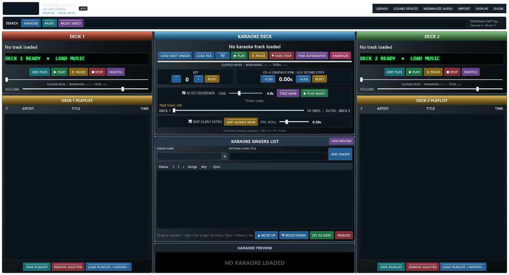

# Hazz Karaoke Hoster User Manual

Version 1.0. This guide explains how to set up a show, use each main feature and keep your singers and music organised. Follow the numbered steps in the section you need. Buttons are written as they appear in the app.

## 1 Find your way around

This is a render of the v1.0 console layout with empty lists, made from the current interface source. It includes SOUND DEVICES, NORMALIZE AUDIO, MUSIC VIDEO and next-track status. The logo and live data are not loaded in this layout view. Dialog instructions below describe their actual controls; this image is not a picture of those dialogs.

The left and right columns are music players. The centre contains the karaoke player, singer rotation and private preview. The top search buttons choose which library you search. Green buttons start playback, red buttons stop or remove, yellow buttons pause or adjust, blue buttons load or navigate, and teal buttons add or save. Active buttons become brighter.

### Fit the console to your screen

1. Maximise the main window. Hazz scales the console to the available space.
2. Drag the dividers between columns or centre rows to give the section you need more room.
3. Choose SHOW > Toggle Karaoke Preview, or use HIDE PREVIEW, to free space for singers.
4. Use SHOW > Karaoke Only Mode if you do not need either music deck. Hidden music is stopped; turn the mode off to restore the deck workspace.

## 2 Prepare your first show

1. Connect your music drive, sound equipment and audience television before opening Hazz.
2. Set Windows displays to Extend so the host and audience have different screens.
3. Extract the portable ZIP. Run Hazz Karaoke Hoster.exe from the extracted folder.
4. Import your folders using section 3, then test an audio track, a CDG song and a video.
5. Set SOUND DEVICES and levels using section 4.
6. Press TV to send the audience screen full screen to Display 2. If Display 2 is missing, the shortcut warns rather than covering Display 1.
7. Set the logo, background and scroller using section 9.
8. Choose SHOW > New Show when ready to clear the previous active rotation. This does not clear permanent singer names or history.

## 3 Import and search your music

### Import folders from your computer

1. Choose IMPORT > Import Karaoke Folders for singer tracks, or Import Music / Video Folders for interval music and VJ videos.
2. Use Add Folder to choose a source. Add more folders if needed; Remove Selected removes a pending folder and Clear clears the pending list.
3. Choose Import All and let the progress window finish. Use its Cancel control if you need to stop the import.
4. Search for a known track and play it before relying on the import during a show.
5. Keep the source drives connected. Hazz indexes files; it does not copy the whole media collection into the database.

Imported folders are watched for new files while Hazz is running. Choose LIBRARY > Rescan Watched Folders after adding files while the app was closed or if changes were missed. Supported playback depends on Windows codecs as well as the file extension. Common audio formats include MP3, WAV, WMA, M4A, AAC, FLAC and OGG; common video formats include MP4, MKV, AVI, MOV and WMV. Karaoke includes ZIP packages and CDG with matching audio.

### Find a song and add it

1. Click KARAOKE, MUSIC or MUSIC VIDEO beside the search box. MUSIC VIDEO shows only videos in the music library.
2. Type part of the title, artist or indexed folder information. Karaoke also supports manufacturer and disc information.
3. For karaoke, drag the result onto a singer, or directly onto the Karaoke Deck to load it without assigning a singer.
4. For music, drag the result to a deck playlist or use Add to Deck 1 or Add to Deck 2. Both deck playlists remain accessible beside the search results.
5. Close the results panel when finished. This leaves your queues unchanged.

### Select several music tracks

1. Click the first result, hold Shift and click the last to select a range.
2. Hold Ctrl and click to add or remove separate tracks from the selection.
3. Use Ctrl+A or Select All for the visible result set, then drag the selection or use a deck button.
4. Check the resulting playlist order. Selecting all results does not mean every track in the database.

### Use Space-bar quick play

1. Search in MUSIC or MUSIC VIDEO and highlight a result.
2. Press Space to play it immediately without adding it to a playlist. Existing music fades into quick play.
3. Press Space again to stop quick play.
4. Use PLAY MUSIC or start the next karaoke song when ready to continue. Quick play has its own sound-device setting.

### Import from another program

1. Close the other program so its exported files are stable.
2. Choose IMPORT > Smart Import — Choose File for an export or database. Use Smart Import — Application Folder when the data is spread across a folder.
3. Read the detected program, media classification, counts and sample rows in the preview. Check that the paths point to your real media.
4. Enable Verify files exist only if you want every path checked; this can take much longer on a large collection.
5. Choose Import Into Hazz. The source is read-only; imported records are written into Hazz.
6. Test searches and a few songs before removing or changing any source data.

Detection is not a guarantee that every version of every program is supported. Hazz handles recognised databases, readable exports and playlist formats. If a proprietary file cannot be understood, keep the original and use an export format supported by the preview.

### MediaMonkey

1. Close MediaMonkey and choose its database through Smart Import.
2. Check sample paths, particularly the drive letter and folder. The importer reconstructs recognised drive-relative paths.
3. For a large collection, start with file verification off.
4. After import, test one track from each music drive. If a path is wrong, correct the drive/source selection and reimport with the current importer.

### BPM Studio and duplicate groups

1. Choose IMPORT > Import BPM Studio and select its data/archive folder.
2. Review the preview and begin the import.
3. Wait through indexing, virtual-folder linking and the final database stages. Do not start another import while it is finishing.
4. Open LIBRARY > Browse Library and expand BPM Studio.

Readable GRP and PLG groups become folders. If several group files have the same filename, the newest modified copy is used; if dates tie, the larger copy wins. Unchanged groups are skipped on repeat imports. Files with no recoverable media paths are reported instead of creating invented links.

### Import singer history or Karma data

1. Choose IMPORT > Singer History and select the history export or supported database.
2. Check the detected singer, artist, title, path and date fields in the preview.
3. Confirm the import, then choose an imported singer and open Songs and History to check the result.
4. For Karma, use the dedicated Karma — Singers / History or Karma — Karaoke Library commands as appropriate.

Recognised history formats include CSV, TSV, JSON, XML and supported SQLite or Access-based databases. Matching tracks link to the Hazz library; unmatched performances can remain as history. Keep a backup before reimporting, because repeated imports may replace earlier rows from that source.

## Audience video engine and CD+G picture

Open **DISPLAY > Audience video engine** and choose **Windows (default)** or
**VLC (Windows fallback)**. The choice is saved and included in venue profiles.
It takes effect on the next video loaded; changing the menu does not interrupt
the current song. Reload a stopped video to compare the engines.

VLC is used only for the audience karaoke and music-video picture. Audio routing,
pitch control and the private preview keep their existing playback engines.
Audience video stays muted to avoid duplicate sound. If VLC cannot open a video,
Hazz attempts Windows playback and records the fallback in the Logs folder.
Fullscreen placement and the existing audience overlay choices still apply.
Background slideshow videos retain their existing muted looping playback.

**DISPLAY > Smooth CD+G picture** softens enlarged pixel patterns in both the
preview and audience window. Untick it for crisp pixels. This preference is saved.
CD+G transparency handling has also been corrected so opaque grey artwork does
not incorrectly become black. Smoothing is separate from that colour correction.

The VLC runtime is included in the download. Extract and keep the whole folder,
including `libvlc` and the DLLs; copying only the EXE will not include VLC support.

## Main-window text size

If the playlists, singer list or controls are difficult to read:

1. Open **DISPLAY** at the top right of the main window.
2. Choose **Main interface text size**.
3. Choose **110%**, **125% — Larger**, or **150% — Largest**. The change appears immediately.
4. Try a playlist and the singer list. Rows grow to fit the larger lettering;
   long lists still scroll and keep their normal selection and drag-and-drop behaviour.
5. To restore the original lettering, choose **100% — Original**.

Hazz remembers this choice when you close and reopen it. Venue profiles also
include the setting, so loading a saved venue can restore that venue's text size.
This changes the main console, including its search results, both playlists,
side list, singer list, buttons and menus. Separate browser/dialog windows keep
their existing text sizes. It does not change the text shown to the audience;
adjust that separately in **DISPLAY > Audience Settings**. Larger text leaves
room for fewer rows. You can hide the karaoke preview to give singers more room.

## 4 Sound devices and audio levels

### Choose an output for each player

1. Stop all players before changing sound devices.
2. Click SOUND DEVICES on the top menu.
3. Choose an output for Deck 1, Deck 2, quick play and Karaoke. Windows default is available if you want Windows to choose.
4. Click SAVE. Reload a karaoke track that was already loaded.
5. Play a short test on each player and check the intended mixer channel or speaker.

If a saved device is missing, Hazz reports it rather than silently routing to another output. Reconnect it or select an available output. Device names can change when hardware or drivers change.

### Use Normalize Audio

1. Click NORMALIZE AUDIO at the top.
2. Enable Normalize All Audio if you want gradual levelling between files.
3. Start at the default target of -18 dB RMS. Move toward -24 for a quieter target or toward -12 for a louder target.
4. Test a quiet and a loud track at a comfortable mixer level. Adjust the target gradually.
5. Click SAVE AND CLOSE to retain the settings. Turn the option off to return to unprocessed levels.

This levels audio during playback; it does not rewrite files. It uses RMS levelling, not whole-file LUFS measurement. The per-player peak limiter does not guarantee that several mixed outputs cannot overload an external mixer. Microphone levels are controlled by your microphone/mixer equipment. Some karaoke audio paths require reloading before processing is available.

## 5 Music decks and playlists

### Play pause seek and stop

1. Use ADD FILES, drag search results, or choose LOAD PLAYLIST / HISTORY to put tracks in a deck.
2. Select a track and press PLAY. The scrolling LED identifies the artist, title and player state.
3. Use the deck VOLUME slider to set its level.
4. Press PAUSE to hold the current position. Press it again, or PLAY, to resume.
5. Drag the timeline to the required time. You can seek while paused; check the target time before resuming.
6. Press STOP when finished. Already-played entries are consumed from the live queue; media files are not deleted.

### Arrange save and reload a playlist

1. Drag unplayed rows to reorder them. Use SHUFFLE for a random remaining order.
2. Select unwanted unplayed rows and choose REMOVE SELECTED, or press Delete with the list focused.
3. Click SAVE PLAYLIST, enter a name and save the remaining order. Reusing a Hazz playlist name replaces that saved list.
4. Use LOAD PLAYLIST / HISTORY to reopen a saved or imported list.
5. In LIBRARY > Music History / Lists, use Refresh to reload records, then load selected tracks or a complete list into the required deck.

### Automatic crossfades

1. Add tracks to both decks and enable AUTO CROSSFADE.
2. Set TIME for the desired transition length.
3. Start a deck. Near the end, Hazz prepares and fades into the next scheduled track.
4. Use FADE NOW for an immediate transition when a next track is available.
5. Turn AUTO CROSSFADE off to stop automatic alternating. The balance display shows the transition; it is not a manual mixer fader.

### Single Deck and Side List mode

1. Choose SHOW > Single Deck + Side List Mode.
2. Deck 1 remains the music player. The right side becomes a preparation list with no player controls.
3. Use Add Files or Load List, or drag search results into the side list.
4. Select rows with Ctrl/Shift, then use Move Up, Move Down or Shuffle List to arrange them.
5. Drag selected tracks to Deck 1, or use Send to Deck 1. They move to the end of Deck 1 in their current order.
6. Save List stores the side list. Remove Selected or Clear List removes list entries only.
7. Turn the mode off to restore the two-deck workspace.

## 6 Singers requests and permanent history

### Add a new or returning singer

1. In SINGER NAME, type the singer's name. The optional song-title box is for request text, not a second singer name.
2. To find a returning singer, open the name arrow or type part of their name. The picker shows about 100 recent/matching names while searching the complete saved singer database.
3. Choose the name and click ADD SINGER.
4. Search KARAOKE and drag a song onto that singer's row.
5. Double-click the singer, or right-click and choose OPEN SONGS & HISTORY, to review their requests.

### Manage requests and previous songs

1. Open the singer's Songs and History window.
2. Select a queued request. Use Song Up/Down to reorder or Remove Song to remove it.
3. Set the requested key and CDG sync for that song if needed.
4. Search history by artist/title. Clear resets the history search filter; it does not delete permanent history.
5. Double-click or drag a previous performance to request it again. Check the last-sung date, times sung, key and sync.
6. Close the window when finished. A duplicate-song warning can be reviewed and overridden by the host.

### Manual order hold skip and remove

1. Leave software-managed rotation off for the original host-controlled order.
2. Drag singers or use MOVE UP, MOVE DOWN and SET AS NEXT.
3. Right-click a temporarily absent singer and choose HOLD SINGER. Release the hold when they return.
4. SKIP ONCE moves the singer to the bottom once. It does not erase their requests.
5. EDIT NAME / NOTES changes the saved singer details. CLEAR QUEUED SONGS removes current requests.
6. REMOVE FROM SHOW removes that singer from this show only. It does not delete their permanent record.

History is recorded when a performance starts. Stopping early does not make it an unplayed song. Without a venue profile, names and history still save in the main database for future sessions.

## 7 Play karaoke

### Load and perform a request

1. Press LOAD NEXT SINGER. Hazz loads an eligible singer's next request.
2. Check the displayed singer, song and private preview.
3. Press TV if the audience display is not ready.
4. Press PLAY. Background music is suspended and the karaoke picture takes priority.
5. Use PAUSE and RESUME if necessary.
6. At the end, let playback finish or press FADE STOP. Karaoke fades down over 1.5 seconds and returning background music fades in over 1.5 seconds.
7. Load and check the next request before starting it.

### Load without a singer

1. Click LOAD FILE and choose a supported karaoke file, or drag a karaoke result/file onto the Karaoke Deck.
2. Check the preview. Loading does not start playback.
3. Press PLAY when ready. Assign a singer through the normal queue when you want singer-linked history.

### Key and lyric timing

1. Use KEY minus/plus for the singer's requested pitch, from -6 to +6 semitones. RESET returns to zero.
2. If CDG lyrics are late, use -0.25s to show them earlier. If early, use +0.25s to show them later.
3. CDG RESET returns the timing offset to zero. These controls affect CDG graphics, not a video's embedded lyrics.
4. Store the request's key/sync in Songs and History for future use. Check playback: pitch support depends on the available audio path and format.

### Silence and alternatives

1. Enable SKIP SILENT INTRO to pass leading silence at the start of karaoke.
2. Set PRE-ROLL to keep a little time before the detected sound so the start is not abrupt.
3. Use SKIP SILENCE NOW when the current position is silent and you want the next audible point.
4. Use FIND ALTERNATIVE only when ready for the replacement to start: it loads and starts another indexed artist/title version automatically. It needs a track loaded from the library/search with an indexed title. If the next version is missing, the app reports it; press again to try another candidate.

### Kamikaze karaoke

1. Select the singer, or use the next singer in the rotation.
2. Use KAMIKAZE, or the singer's right-click Kamikaze action, to assign a random library song.
3. Press again before playback if another random choice is wanted.
4. Check the result and press PLAY. The configured audience message disappears when karaoke starts.

## 8 Choose a rotation method

### Turn computer sorting on or off

1. Open SHOW > Rotation Settings.
2. Choose a method and its available options.
3. Tick Enable software-managed rotation to activate it. Choosing a method alone does not enable sorting.
4. Save/apply the settings. The shortcut SHOW > Automatic Fair Singer Rotation also toggles it.
5. Untick it to return to manual order before making host overrides.

Manual is the default. An explicit saved opt-in is remembered and may also be restored by a venue's settings. A turn counts when PLAY starts the singer request; pause/resume does not add another. Interrupted turns still count. Imported lifetime history is not the current show's turn count.

### Round robin

1. Select Round robin and enable software-managed rotation.
2. Choose how newcomers join: end of this round, next round, or interleaved.
3. Run requests normally. Each ready singer gets one turn per round in arrival order.

### Closed rounds

1. Select Closed rounds and enable sorting.
2. Start the round. New singers added after it starts wait for the next round.
3. Continue normally; the next round begins when no ready eligible singer remains.

### Newcomers at the end

1. Select Newcomers at the end and enable sorting.
2. Add late arrivals as usual.
3. Hazz appends them to the current round, while retaining one turn per ready singer in that round.

### Interleaved newcomers

1. Select Interleaved newcomers and enable sorting.
2. Set the spacing from 1 to 10 returning singers.
3. Add newcomers normally. Hazz inserts a newcomer after that many returning singers when both types are available; remaining singers continue when one type runs out.

### Longest waiting

1. Select Longest waiting and enable sorting.
2. Choose the tie-breaker and optional consecutive-turn protection.
3. Hazz compares arrival/previous-turn order, not a wall-clock minute counter. There are no round boundaries.

### Fewest turns

1. Select Fewest turns and enable sorting.
2. Choose the tie-breaker, such as Longest waiting.
3. Hazz prioritises the lowest started-turn count in this show. Newcomers may catch up quickly; enable consecutive-turn protection if desired.

### Group rotation

1. Select a singer in the main queue before opening Rotation Settings.
2. Enter their group name, such as Table 4. Use the same name for other members; a blank group means an individual slot.
3. Select Group rotation, set newcomer handling and enable sorting.
4. Hazz gives each group one song per round, using its longest-waiting ready member. This is group scheduling, not a separate duet-history system.

### Arrival order

1. Select Arrival order and enable sorting.
2. Choose the available tie-breaker/protection settings.
3. Hazz sorts by original arrival without rounds. This differs from round robin and can favour earlier arrivals.

Held singers and singers without songs remain behind ready singers. The current performer keeps their slot. Rounds advance rather than waiting indefinitely for held/unready people. New Show resets turn/group records; show recovery preserves them. Loading a venue singer list starts fresh turn counts.

## 9 Audience screen backgrounds and videos

### Place the audience screen

1. Choose DISPLAY > Open Audience Display.
2. Choose Send Full Screen To and the intended monitor, or press TV for Display 2.
3. Use Windowed / Move & Resize during setup, then return to full screen.
4. Recheck the display selection when you change cables or monitors. Keep host controls on the host display.

### Set next singers and scroller

1. Open DISPLAY > Audience Settings — Backgrounds, Logo, Scroller.
2. Tick Show next 4 singers and optionally Show songs.
3. Choose singer font, size and position. Use the individual colour buttons for heading, number, singer, song/artist, rotation and venue message.
4. Enable the full singer rotation scroller, enter the venue message and set font, size and speed.
5. Choose Top or Bottom for the scroller. Check readability on the actual audience screen.
6. Close the panel when finished. These settings apply live; singer information is hidden during karaoke as configured by the app.

### Image GIF video or slideshow background

1. Enable Singer-view background.
2. Click IMAGE / GIF / VIDEO for one file, or CHOOSE FOLDER for a slideshow.
3. Choose Screen fit: Fit shows everything, Fill crops edges, Stretch fills the screen with distortion, and Center uses original size.
4. Adjust GIF speed from 0.25x to 4x if using animation.
5. Check the audience screen. Each slideshow item gets one minute; a video loops silently within its slot before the next item takes over.
6. Use CLEAR to remove the chosen source. Media must remain at its saved path.

### Permanent logo and Kamikaze message

1. Enable Persistent audience logo and click CHOOSE LOGO. A transparent PNG works well.
2. Choose position and width, then check that it does not cover lyrics.
3. Use CLEAR to remove it or untick the option to hide it.
4. In the Kamikaze section, enter the message and choose font, size and colour. It appears after a random assignment until playback starts.

### VJ music videos and overlays

1. Import video folders as Music / Video and search MUSIC VIDEO.
2. Add a video to Deck 1 or 2 and press PLAY. The audience picture follows the deck; its separate video copy is muted so you hear only the deck audio.
3. Pause, seek or stop from the deck. Karaoke takes picture priority when started.
4. In Audience Settings, find SHOW DURING MUSIC VIDEOS.
5. Tick Permanent logo, Rotation / venue scroller, Next singers or Kamikaze message to allow each overlay. Its normal setting must also be enabled.
6. Leave all those options off for an unobstructed music video. Background artwork stays hidden during video playback.

## 10 Virtual folders

Virtual folders are named collections of links. They do not move or duplicate your media files.

### Create folders and nested folders

1. Open LIBRARY > Browse Library.
2. Click NEW FOLDER and enter a name such as 80s.
3. Select 80s, click NEW SUBFOLDER and enter Rock to make 80s / Rock.
4. Select a folder to see its directly assigned tracks. A parent does not combine its children's tracks.

### Add and use tracks

1. Select ALL LIBRARY TRACKS or another source folder. Choose KARAOKE or MUSIC.
2. Search or sort. Use First/Previous/Next/Last to change pages, or enter a page and click Go. Descending reverses the selected sort.
3. Select tracks using Ctrl/Shift, or Ctrl+A for the current visible page.
4. Click ADD SELECTED TO FOLDER, choose the destination and confirm. You can also drag tracks onto a folder in the tree.
5. Select that folder to use its tracks. Add karaoke to the selected singer or music to a deck.
6. The same track can belong to several folders; repeated addition to one folder keeps one link.

### Rename remove empty or delete

1. Select a folder and use RENAME to change its label.
2. Use REMOVE FROM FOLDER to remove selected track links.
3. EMPTY removes all direct links but keeps subfolders.
4. DELETE removes the folder, children and their links after confirmation.
5. Return to ALL LIBRARY TRACKS to find the underlying songs. None of these actions deletes the media files.

### Import VirtualDJ or other folder lists

1. Close the source program.
2. Use IMPORT > Smart Import — Application Folder and select its main data/export folder, not just one database file.
3. For VirtualDJ, include MyLists/Playlists/Folders alongside database.xml.
4. Check the preview and import. Browse the resulting application folder in the Library Browser.
5. Read the completion report if a folder is absent. Readable VirtualDJ lists, Rekordbox XML and common playlist trees are supported; not every proprietary crate is readable.

## 11 Venue profiles and singer saving

Venue settings and singer lists use separate controls. APPLY changes display/audio/layout settings. LOAD SINGER LIST replaces the current saved names, history and singer queue. The music library remains shared.

### Save your first venue

1. Stop playback and set up sound, display, layout and rotation preferences.
2. Open SHOW > Venue Profiles. Enter a name such as Monday Club and click SAVE CURRENT.
3. Select Monday Club and click SAVE SINGER LIST.
4. Check the status showing the active singer venue. Its singers now save when requested, before changing singer lists and on normal shutdown. There is no timed venue-save interval.

### Return to a venue

1. Stop all players and select the saved venue.
2. Click APPLY for its settings. Check devices and display after hardware changes.
3. Leave Load saved song history ticked, or untick it to start that venue's permanent history fresh.
4. Click LOAD SINGER LIST and confirm replacement. Hazz first saves the outgoing active venue and makes a singer backup.
5. Check the loaded queue and reload the karaoke track. Loading does not start audio; turn counts restart.

### Start blank or carry regular followers

1. Open Venue Profiles while stopped. Save the current list to its venue first if not already active.
2. To preserve the old venue while keeping selected followers, click USE WITHOUT VENUE before KEEP SELECTED SINGERS.
3. Ctrl-click names or Shift-click a range, click KEEP SELECTED — REMOVE OTHERS and confirm. An empty selection removes everyone.
4. Alternatively choose START BLANK SINGER LIST to clear all current names/history/queue after backup; this disconnects the old venue.
5. Create/select the new venue and click SAVE SINGER LIST. This makes it active for later saves.

If you use KEEP SELECTED while the old venue remains active, that reduced list will be saved back to the old venue on the next save/change/close. Disconnect first when you want the old list preserved.

### Work without a venue

1. Choose USE WITHOUT VENUE. Hazz saves and disconnects any active venue while retaining current singers.
2. Continue the show normally. Names and history still save in the main database.
3. Close Hazz normally. You do not need a venue profile to retain singer history.

### Clear history restore backups or maintain profiles

1. CLEAR HISTORY ONLY removes current permanent performances while keeping names and queued songs. If a venue is active, the change will also update it.
2. RESTORE SINGER BACKUP lets you choose a singer snapshot. Confirm to replace current names/history; a backup is made first.
3. A matching .queue.json sidecar restores the queue. Without it the active queue starts empty.
4. Restoring disconnects the named venue. Save to the intended venue to reconnect it.
5. RENAME changes a profile name. DELETE removes the named profile, not current singers, media or retained snapshot files.
6. To copy settings, apply a profile, enter another name and SAVE CURRENT. Save its singer list separately if wanted.

Back up venue-profiles.json together with the entire venue-singers folder beside the database. Artwork is linked by path, not copied into a profile. Singer safety backups and manual snapshot revisions are retained; inspect their size occasionally. Settings edits do not automatically update the named profile: use SAVE CURRENT. A failed final venue save leaves Hazz open to retry.

## 12 Backups recovery and show checks

### Check the next music track

1. Load the planned music queues and enable the intended automatic progression/crossfade mode.
2. Read the next-track status below the automation controls.
3. Hazz opens the candidate in a muted standby player. Reordering the queue changes the candidate.
4. Replace a missing, empty or decoder-rejected track before it is needed. A timeout is unverified, not proof that a file is broken.

Ready means the file opened, not that every part of it has been checked. A drive/device failure or corruption later in a track can still interrupt playback.

### Run the pre-show health check

1. Load the intended music and singer queues.
2. Choose SHOW > Pre-show Health Check.
3. Review missing/inaccessible paths and connected display information.
4. Correct problems and play a short physical sound/display test separately. The check does not test microphones or scan every byte of every song.

### Make and manage backups

1. Before major imports, use LIBRARY > Backup Database and choose another drive for the copy.
2. Use LIBRARY > Open Automatic Backups to inspect daily compressed ZIPs.
3. Hazz keeps at most three generated ZIPs within a 1 GB budget. The newest is always retained even if it alone exceeds that size.
4. Extract a ZIP to a separate folder to inspect its database and settings. Do not overwrite the live database while Hazz is open.
5. Old uncompressed .db backup copies and matching .db.settings folders are not deleted automatically. After checking your new backup, remove unwanted old pairs from the backup folder if you need the space.
6. Back up venue-profiles.json and venue-singers separately too; automatic database ZIPs do not include that subfolder. A backup on the same disk does not protect against disk failure.

Compression needs temporary space for an uncompressed snapshot and the new ZIP. Hazz validates the new archive before retiring older generated ZIPs. There is no full-database restore wizard; the singer-backup restore is a separate feature.

### Recover an interrupted show

1. Reopen Hazz and review the restore prompt.
2. Choose to restore the previous singer requests and remaining music when wanted.
3. Check the recovered track and position. Recovery does not automatically start sound.
4. Press the appropriate Play/Resume when ready. Recent actions can be newer than the last recovery checkpoint.

Recovery checkpoints run about every 15 seconds. These working recovery writes are separate from venue snapshots; there is no timed venue save. Hazz reduces repeated display updates when minimised while music automation, fades and audience synchronisation continue. This is not a guarantee against every crash or hardware failure.

### Finish the show

1. Save any playlists you want to reuse.
2. Stop playback and close the main window.
3. Confirm shutdown. Hazz saves the active venue, if any, before closing.
4. If a save error appears, Hazz remains open; correct the storage problem and retry.
5. Wait for the app to close before unplugging media drives. No-venue history remains in the main database.

## 13 Common problems

### A track is red broken or missing

1. Read the failure reason, then check the drive connection and exact file path.
2. Restore the file or reconnect the drive. Test it in another Windows player if decoding fails.
3. Rescan the watched folder after correcting paths and choose a known-good alternative for the show.
4. A virtual folder only links to the original file; adding it again does not repair a missing file.

### Search or a virtual folder looks empty

1. Clear the search text and check KARAOKE versus MUSIC versus MUSIC VIDEO.
2. In the browser select ALL LIBRARY TRACKS, then check the intended parent/child folder.
3. Remember that a parent shows its own direct links, not all child songs.
4. Check the import completion report and reconnect the original media drive.

### No sound or no audience picture

1. Check deck volume, Windows/mixer volume and the selected SOUND DEVICES outputs.
2. Stop playback, reconnect/select an available output, and reload karaoke after changing its device.
3. For picture, check Windows Extend mode, television input and cables.
4. Open the audience display and explicitly send it to the correct monitor. Test before guests arrive.

### Imported data is slow or incomplete

1. Leave file verification off for a first large database migration.
2. Read the phase text during final indexing/linking/commit stages rather than the percentage alone.
3. Cancel using the import window if needed; do not start a second simultaneous import.
4. Keep the source files and completion report for unsupported formats or wrong paths.

## 14 Build the source in Visual Studio 2026

1. Install Visual Studio 2026 with .NET Desktop Development and the .NET 10 SDK.
2. Extract the source ZIP and open HazzKaraokeHoster.sln.
3. Select Release and x64, restore packages, then Rebuild Solution.
4. Run RELEASE/HazzKaraokeHoster/Hazz Karaoke Hoster.exe. The normal bin folder can contain many build files; the RELEASE folder contains the published single-file app.
5. BUILD-EXE.cmd is the command-line alternative.
6. If publishing fails, close any running copy, check SDK/workload installation and read the first real build error before the final wrapper error.

## 15 Quick daily checklist

1. Connect drives, sound and Display 2; confirm power and sleep settings for a long show.
2. Load venue settings and its singers, or choose USE WITHOUT VENUE.
3. Check the rotation mode; manual is the default unless you chose computer sorting.
4. Test audio, karaoke lyrics, a video and audience overlays.
5. Check queued files, next-track readiness and backups.
6. Run the show, then close normally and let the final save finish.
