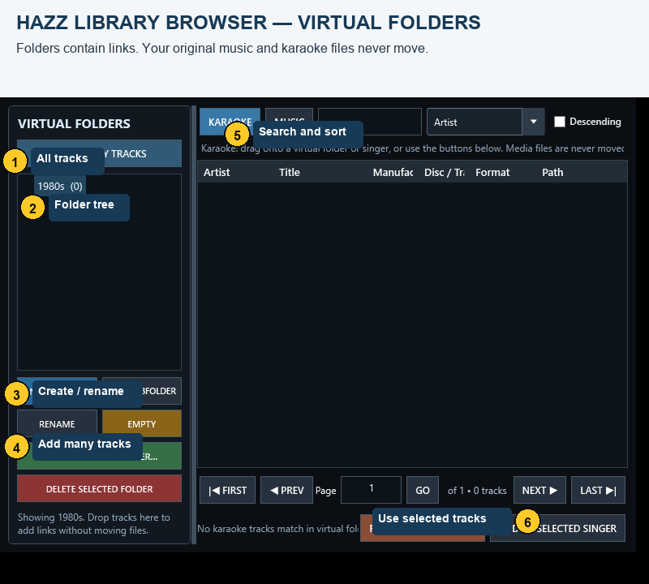

# Hazz Virtual Folders — Complete Guide

Virtual folders let you organise tracks into named collections such as **80s**, **Rock**, **Jingles**, **Floor Fillers** or **Requests**. They contain links to songs already indexed by Hazz. Your audio, video, ZIP and CDG files remain in their original Windows folders.

## Open the Library Browser

1. Choose **Library > Browse Library**.
2. The browser opens maximised. The **Virtual Folders** panel is on the left.
3. Select **All Library Tracks** whenever you want to return to the full library.
4. Choose **Karaoke** or **Music**, then search or sort the list as needed.

## Create a folder

1. Press **New Folder**.
2. Enter a name, for example `80s`.
3. Press **Create**. The new folder appears in the left tree.

## Create a nested folder

1. Select the parent folder, for example **80s**.
2. Press **New Subfolder**.
3. Enter a name such as `Rock`.
4. The new path is **80s / Rock**.

A parent shows tracks linked directly to that parent. It does not automatically combine all tracks from its children. Select the child folder to see the child's tracks.

## Add one or several tracks

1. Select **All Library Tracks** or another source folder.
2. Choose the **Karaoke** or **Music** tab.
3. Select tracks:
   - click once for one track;
   - hold **Ctrl** and click to select separate tracks;
   - click the first track, hold **Shift**, and click the last track for a continuous range;
   - press **Ctrl+A** to select every visible result on the current page.
4. Press **Add Selected to Folder…**.
5. In the destination picker, select the full folder path and press **Add Tracks**.

You can also drag the selected rows directly onto a folder in the left tree. Adding the same song to the same folder again is harmless; Hazz keeps one link.

## Put one track in several folders

Repeat **Add Selected to Folder…** for each destination. A track can appear in **80s / Rock**, **Party / Floor Fillers**, and another folder at the same time. All entries point to the same library song and physical file.

## Use a folder during a show

1. Select the folder in the left tree.
2. Use the search box to narrow that folder.
3. In **Music**, add selected tracks to Deck 1, Deck 2 or the Single Deck side list.
4. In **Karaoke**, add the selected song to the highlighted singer.
5. Select **All Library Tracks** to leave the folder and browse everything again.

## Rename, empty, remove and delete

- **Rename** changes the selected folder name. Its tracks and children stay linked.
- **Remove from Folder** removes only the selected track links from the open folder.
- **Empty** removes all direct track links from the selected folder. Its subfolders remain.
- **Delete Selected Folder** removes the selected folder, its subfolders and their virtual links.

None of these actions deletes a song from the Hazz library or removes a file from disk.

## Import folders from BPM Studio

1. Close BPM Studio.
2. In Hazz choose **Import > Import BPM Studio**.
3. Select the BPM Studio data or archive folder.
4. Check the preview counts and confirm the read-only fast import.
5. Hazz imports BPM playlists and daily history and reads recoverable `.GRP` and `.PLG` archive-group files.
6. Open **Library > Browse Library** and expand **BPM Studio**.

BPM archive filenames become Hazz folder names. Physical directories below the selected BPM folder become nested Hazz folders. Track files stay where they are. If a proprietary group contains no recoverable media paths, Hazz reports it as unreadable or unsupported at the end instead of inventing links.

Hazz compares duplicate `.GRP` and `.PLG` filenames before reading them. Only the newest modified copy is imported; if dates match, the larger copy is used. Unchanged groups are skipped on repeat import. Song indexing and virtual-folder links are saved in batches, with separate progress phases for linking, committing and finalising the database.

## Import folders from VirtualDJ and other software

1. Close the other DJ or karaoke program so its files are stable.
2. Choose **Import > Smart Import > Detect from Application Folder**.
3. Select the program's main data/export folder. For VirtualDJ, select its home folder containing `database.xml` and **MyLists** or **Playlists**.
4. Check the detected program and sample tracks, then start the read-only import.
5. Open **Library > Browse Library** and expand the folder named after the detected application.

Supported organisation includes VirtualDJ 2024 **My Lists** (`.vdjfolder` or XML), older VirtualDJ M3U/PLS playlist trees, Rekordbox XML playlist folders, and nested M3U, M3U8, PLS, XSPF or WPL exports from other programs. Each list becomes a Hazz virtual folder; directories around the list become parent folders. Unsupported proprietary crates are reported and left untouched.

## Examples

- **80s / Rock** — decade first, then genre.
- **Jingles / Station IDs** — show elements separated from background music.
- **Party / Floor Fillers** — reliable dance choices for quick loading.
- **BPM Studio / FileArchive / 80s** — example of an imported BPM archive group.

## Troubleshooting

- **“Choose a virtual folder first.”** Use **Add Selected to Folder…**, then select the destination in the picker. If none exists, create one first.
- **The folder looks empty.** Clear the search, check Karaoke versus Music, and confirm you selected the correct parent or child.
- **The count and visible rows differ.** The folder count covers direct links; the active Karaoke/Music filter and search can show fewer rows.
- **A button is clipped.** Maximise the Library Browser. v0.80 adjusts the folder panel to the available width.
- **BPM folder missing.** Confirm the selected location contains `.GRP` or `.PLG` files and read the completion report.
- **BPM import is near 100%.** Check the displayed phase. Linking folders, committing and finalising are reported separately. Wait for **Import complete** before starting another import or closing Hazz.
- **VirtualDJ folders missing.** Select the whole VirtualDJ home folder rather than only `database.xml`, so Hazz can also see **MyLists**, **Playlists** and **Folders**.
- **A file is missing or broken.** Virtual folders do not copy media. Reconnect the original drive or restore the indexed file path.
