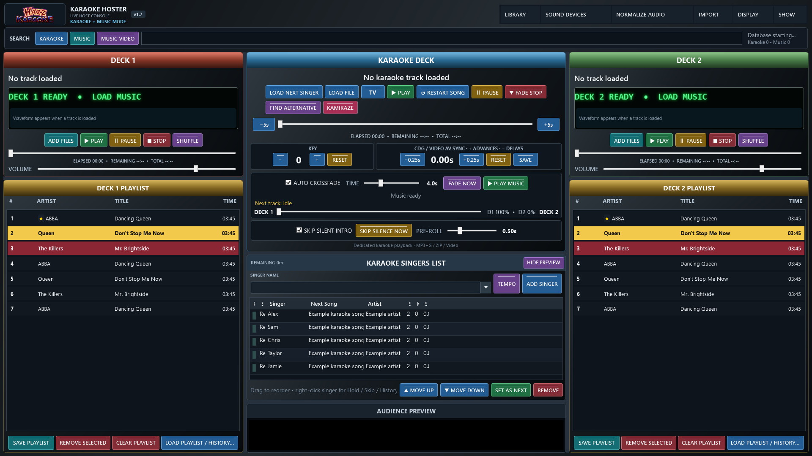

# Hazz Karaoke Hoster

Current release: **v1.74.8** — dedicated Music Video imports/library, previous-search reopening on focus, and an expanded music-video transition set including Random Fancy. [v1.74.8 instructions](Documentation/RELEASE_v1.74.8.md).

**v1.74.8 patch:** broad Karaoke searches no longer stop at 300 results, and Disc sorting now uses natural numeric order without dropping valid matches.

**v1.74.7 patch:** Music Playlists & History now includes a safe Delete Playlist option. It removes only the selected playlist/database entries, never media files or Music History.

**v1.74.6 patch:** Rotation standing now includes every non-HOLD singer, even before they have chosen a song; NEXT still marks the first singer with a song ready.

**v1.74.5 patch:** the singer list now shows each ready singer's standing (1 / N) and clearly highlights the NEXT singer.

**v1.74.4 patch:** queued music tracks can now be dragged directly between Deck 1 and Deck 2; NOW PLAYING remains protected.

**v1.74.3 patch:** Music track lengths now populate in deck/side lists before playback and in Music search whenever the Length column is enabled. Also fixes per-mode Search Columns losing Karaoke Length after switching to Music.

**v1.74.2 patch:** BPM Studio imports now read MP3 Artist/Title tags once per unique track and use them in the Music library, BPM playlists and BPM history. Re-importing repairs older BPM entries that used filename-derived metadata.

**v1.74.1 patch:** restores the Search Columns customiser with per-mode visibility, width and heading-order persistence.
Previous release: **v1.73** — optional Side List virtual-folder browsing (including imported BPM Studio folders), Music Video Fit/Stretch and selectable visual transitions. [v1.73 instructions](Documentation/RELEASE_v1.73.md).

Made For KJ/DJ's By A KJ/DJ

Free-to-use Windows software for hosting karaoke nights, playing background music and showing music videos on a separate audience screen.

Hazz brings a karaoke player, singer rotation and two music decks into one console, with tools for organising large libraries and preparing the next track during a live show.

*v1.7 Classic console shown with illustrative sample rows.*

**[Download for Windows](https://github.com/harryoke/hazz-karaoke-hoster/releases/latest)** · **[Official website](https://harryoke.github.io/hazz-karaoke-hoster/)** · **[User guide](Documentation/V1_MANUAL.md)**

## New in v1.7

Video AV Sync with saved track defaults; a complete, muted audience preview; optional CD+G background transparency with separate opacity sliders and per-song overrides. [Read the v1.7 instructions](Documentation/RELEASE_v1.7.md).

## Retained from v1.6

Fit/Stretch karaoke playback; independent singer-rotation and custom-message switches; a second scrolling message with its own font, size, speed, colour and edge inset. The two bars stay on opposite edges. [Read the v1.6 guide](Documentation/RELEASE_v1.6.md).

## Retained from v1.5

Folder-only Kamikaze, scrolling while dragging through long lists, four complete skins, Karaoke Focus, karaoke seeking, track lengths, history CSV export and saved-data protection. [Read the v1.5 instructions](Documentation/RELEASE_v1.5.md).

## Retained from v1.4

Choose how background music gives way to karaoke: fade and stop (default), fade and pause, or fade and continue silently. See real audio waveforms on both decks and click to seek. Save singer photos per venue, show them in the singer list and on TV, and adjust their size and fit. Search favourites now show yellow stars.

[Step-by-step v1.4 instructions](Documentation/RELEASE_v1.4.md)

## What you can do

- **Host karaoke:** play MP3+G/CD+G, ZIP karaoke and video tracks, with key changes, lyric synchronisation and saved tempo preferences.
- **Manage singers:** add singers, keep their song history and organise the rotation. Manual ordering is the default; optional computer-assisted rotation methods let you choose the rules.
- **Run the music:** use two music decks with playlists, scrolling track displays, seeking and crossfading, or turn Deck 2 into a side list.
- **Organise your library:** search karaoke, music and music videos separately. Create named virtual folders and subfolders without moving media files.
- **Bring existing collections across:** import supported libraries, playlists and singer-history formats from other software, including BPM Studio and MediaMonkey workflows.
- **Control the audience screen:** show karaoke or music videos on a separate display, with configurable singer names, logos, messages, text outlines and scrolling text.
- **Personalise backgrounds:** choose images, animated GIFs or muted looping videos, or run a folder slideshow. Adjust image fit, GIF speed and scroller placement.
- **Set up your sound:** choose output devices for individual players and use optional audio levelling. Choose Windows or VLC for audience video playback.
- **Prepare for a show:** use venue profiles, next-track readiness checks, database backups and recovery tools. Adjust the console text size for readability.

## Get started

1. Download the **Windows portable ZIP** from the [latest release](https://github.com/harryoke/hazz-karaoke-hoster/releases/latest).
2. Extract the entire ZIP to a folder. Keep the DLLs and `libvlc` folder alongside **Hazz Karaoke Hoster.exe**.
3. Open the app and use **IMPORT** to add your music and karaoke folders.
4. Choose your outputs under **SOUND DEVICES**, and configure the audience screen under **DISPLAY**.
5. Add a singer and a song, or add music to a deck. Check the sound and audience output before starting your show.

You supply your own media files. Hazz does not include a song collection.

## Help and documentation

- [Complete user guide](Documentation/V1_MANUAL.md)
- [Tempo and playlist controls](Documentation/TEMPO_AND_PLAYLISTS.md)
- [Virtual folders guide](Documentation/VIRTUAL_FOLDERS_GUIDE.md)
- [v1.2 instructions](Documentation/RELEASE_v1.2.md)
- [Release history](CHANGELOG.md)
- [Report a problem or request a feature](https://github.com/harryoke/hazz-karaoke-hoster/issues)

## Music playlist tools

Read MP3 tags, edit artist/title/album, mark favourites with yellow stars, queue songs next, move tracks between decks, and add them to virtual folders from the right-click menu.

See the [playlist instructions](Documentation/MUSIC_PLAYLIST_MENU.md) and [v1.3 release notes](Documentation/RELEASE_v1.3.md).

## Building from source

Use Visual Studio 2026 with the .NET desktop development workload and .NET 10 SDK.
Open the solution, restore its packages and build the Windows app. For a ready-to-run
copy, use the packaged Windows download above rather than GitHub's automatic source ZIP.

## Copyright and licence

Copyright © 2026 Hazz Karaoke. All rights reserved in the original Hazz Karaoke Hoster code, documentation, branding and artwork. Third-party components remain subject to their respective licences.
Unchanged copies may be shared free with all branding and notices intact. Redistribution
of renamed, rebranded or modified versions requires written permission.

See the [full licence terms](LICENSE.txt). This is source-available software. Third-party
components retain their own licences; see [ThirdParty](ThirdParty/README.md).
